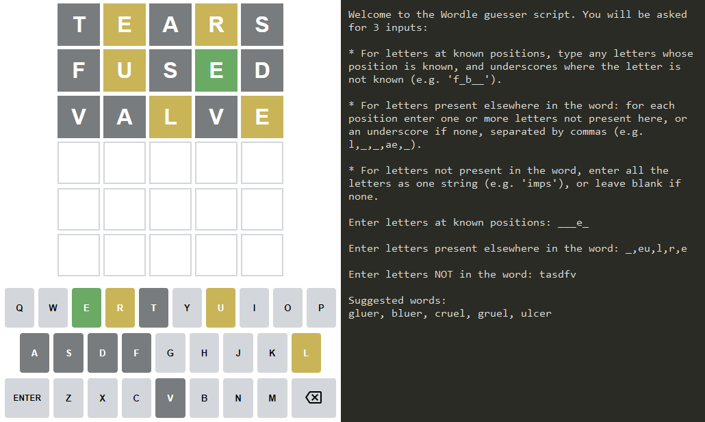

# Wordle guesser

Like many others I've been enjoying the word-guessing game [Wordle](https://www.powerlanguage.co.uk/wordle/). This script was written to return possible solutions given the information known so far in a game.

The list of potential words is generated from the `words` corpus from [NLTK](https://www.nltk.org/), which contains many more words than the potential Wordle solutions, so you may see some unusual words suggested.

### Using the script
Run `wordle_guesser.py`. You will be asked to:
* Enter any letters at known positions, in the format `f_b__`
* Enter any letters present in the word, but known not to be present in certain positions, separated by commas, e.g. `l,_,_,ae,_`
* Enter letters not present in the word as a string, e.g. `imps`

The script will then return all words in the word list that fit these criteria.

Example:

